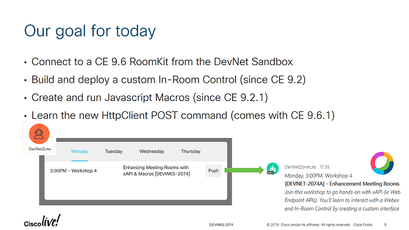

# DNW03 - Create custom In-Room Controls and Macros for CE and Webex Devices

This workshop is presented at Cisco DevNet Zone.
Check the deck from past editions: [Cisco Live Barcelona 2019](docs/cl19b.pdf)

> Join this workshop to go hands-on with xAPI (ie Webex Devices APIs and Cisco Collaboration Endpoint APIs). You'll learn to interact with a Webex Device from code, and implement an end-to-end In-Room Control by creating a custom interface and deploying Macros onto your device
> [check the sessions details](https://ciscolive.cisco.com/us/learn/sessions/content-catalog/?search=2074#/)

In 45 min, you will learn to:

- Use a Room Kit in the DevNet Sandbox
- Build a custom In-Room Control
- Listen to events via SSH
- Create your first Macro
- Post to a Webex Teams space with the HttpClient command

 

## Walkthrough

If you're new to Cisco Collaboration Devices, take this [DevNet learning module](https://learninglabs.cisco.com/modules/xapi-intro).

Then:

- Access the training pod provided at your event (VPN to devnetsandbox-emea-gwy.cisco.com:20339)
- Load and deploy the [provided In-Room Control](./step1-agenda.xml)
- Connect via SSH and type to view control click events:

   ```shell
   xstatus UserInterface Extensions
   xfeedback register /Event/UserInterface/Extensions/Event/Clicked
   ```

- Create and enable the [provided JS macro](./step4-complete.js)


## Step by step instructions

<!-- toc -->
- [Step 0](#step-0)
- [Step 1](#step-1)
  * [Step 1.1](#step-11)
  * [Step 1.2](#step-12)
- [Step 2](#step-2)
- [Step 3](#step-3)
  * [Step 3.1](#step-31)
  * [Step 3.2](#step-32)
- [Step 4](#step-4)

_Tip: check the raw contents, these are ready to paste into a Webex Teams space_

### Step 0

Connect to your RoomKit

```
Sandbox VPN           : devnetsandbox-emea-gwy.cisco.com:20339
Sandbox user          : user01 / user02 / user03 / user04 / ...
Sandbox password      : cisco1234

RoomKit IP            : https://10.10.1.171 ... https://10.10.1.182
RoomKit user          : admin
RoomKit passwd        : ciscopsdt
```

### Step 1

#### Step 1.1

Open the In-Room Controls Editor.

Create a new Panel with a `push` button with id: 'DEVWKS-2074'

or simply import the [provided panel sample](./step1-agenda.xml)

#### Step 1.2

From the terminal, open a SSH session to your device (use PUTTY if on windows):

```bash
ssh 10.10.20.17x
```

- user: admin
- password: ciscopsdt

Then type these commands one at a time:

```bash
xstatus UserInterface Extensions
xfeedback register /Event/UserInterface/Extensions/Event/Clicked
```

When done testing events, unregister with:

```bash
xfeedback deregisterall
```

### Step 2

Once the agenda In-Room control has been created, open the **Macro Editor** and create a new `listen` macro with the following script:

```javascript
const xapi = require('xapi')

xapi.event.on('UserInterface Extensions Event Clicked Signal', (widgetId) => {
    console.log(`new event from widget: ${widgetId}`)

    // Add your custom logic
})

console.log('listening...')
```

### Step 3

#### Step 3.1

We'll now configure your device to allow Http POST/PUT requests:

Go back to your SSH session and type the commands below, one at a time:

```bash
xConfiguration HttpClient Mode: On
xConfiguration HttpClient AllowInsecureHTTPS: True
```

#### Step 3.2

Create another macro named `push` with the following script,
and place your first name on the last line:

```javascript
const xapi = require('xapi');

function push(msg, cb) {

  // Replace with your bot token
  const token = "OGMyZDc3NWQtYTIyNi00MGM5LTk1YzAtMzFlMTc5ZmMwYTgwODdjZTM1ODQtMmRh_PF84_1eb65fdf-9643-417f-9974-ad72cae0e10f"
  // replace with a space your bot is part of
  const roomId = "Y2lzY29zcGFyazovL3VzL1JPT00vODJiY2FkNzAtYzgyMS0xMWU5LWI0YzQtYTU2OThlNTFjZTZj"

  // Post message
  let payload = {
    "markdown": msg,
    "roomId": roomId
  }
  xapi.command(
    'HttpClient Post',
    {
      Header: ["Content-Type: application/json", "Authorization: Bearer " + token],
      Url: "https://api.ciscospark.com/v1/messages",
      AllowInsecureHTTPS: "True"
    },
    JSON.stringify(payload))
    .then((response) => {
      if (response.StatusCode == 200) {
        console.log("message pushed to Webex Teams")
        if (cb) cb(null, response.StatusCode)
        return
      }

      console.log("failed with status code: " + response.StatusCode)
      if (cb) cb("failed with status code: " + response.StatusCode, response.StatusCode)
    })
    .catch((err) => {
      console.log("failed with err: " + err.message)
      if (cb) cb("Could not post message to Webex Teams")
    })
}

push('Hi, this is CHANGME checking...', console.log)
```

### Step 4

Now **disable** the `listen` and `push` macros, 
and create a new `workshop` macro with the following contents:

```javascript
const xapi = require('xapi')

xapi.event.on('UserInterface Extensions Event Clicked Signal', (widgetId) => {
    console.log(`new event from widget: ${widgetId}`)
    
    let markdown = buildMarkdownForSession(widgetId)
    push(markdown)
})


function buildMarkdownForSession(widgetId) {

    let markdown = `no session found for widget identifier: ${widgetId}`
    let session = sessions[widgetId]
    if (session) {
      console.log(`found session with id: ${widgetId}`)
      markdown = `${session.day}, ${session.time}, ${session.location}`
      markdown += `<br/>**\[${session.id}\] - ${session.title}**`
      markdown += `<br/>_${session.description}_`
    }
    
    return markdown
}

const sessions = {}
sessions['DEVWKS-2074'] = {
    id: 'DEVWKS-2074',
    title: "Create custom In-Room Controls and Macros for CE and Webex Devices",
    description: "Join this workshop to go hands-on with xAPI (ie Webex Devices APIs and Cisco Collaboration Endpoint APIs). You'll learn to interact with a Webex Device from code, and implement an end-to-end In-Room Control by creating a custom interface and deploying Macros onto your device",
    location: "Workshop 8",
    type: "workshop",
    day: "Monday",
    time: "4:00PM",
    duration: "45",
    speaker: "Stève Sfartz",
    href: "https://ciscolive.cisco.com/us/learn/sessions/content-catalog/?search=2074#/"
}


function push(msg, cb) {

  // Replace with your bot token
  const token = "YTJkZDlmZjAtMGM3NS00MDUxLWIzNzItNmU0M2I2MDE0ZGRmODcwMTExZGUtNzU0"
  // replace with a space your bot is part of
  const roomId = "Y2lzY29zcGFyazovL3VzL1JPT00vYmEzlkNDktZmI5NTAxNDlhODVl"

  // Post message
  let payload = {
    "markdown": msg,
    "roomId": roomId
  }
  xapi.command(
    'HttpClient Post',
    {
      Header: ["Content-Type: application/json", "Authorization: Bearer " + token],
      Url: "https://api.ciscospark.com/v1/messages",
      AllowInsecureHTTPS: "True"
    },
    JSON.stringify(payload))
    .then((response) => {
      if (response.StatusCode == 200) {
        console.log("message pushed to Webex Teams")
        if (cb) cb(null, response.StatusCode)
        return
      }
            
      console.log("failed with status code: " + response.StatusCode)
      if (cb) cb("failed with status code: " + response.StatusCode, response.StatusCode)
    })
    .catch((err) => {
      console.log("failed with err: " + err.message)
      if (cb) cb("Could not post message to Webex Teams")
    })
}

console.log('listening...')
```